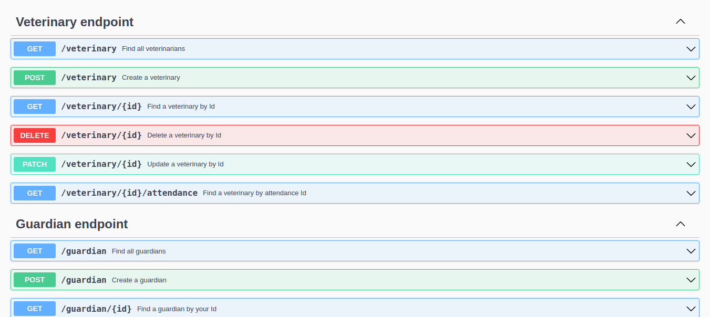

[](https://github.com/Humberto-Bonadiman/clinica-veterinaria-spring/actions/workflows/maven.yml)

# Boas vindas ao repositório do projeto Clínica Veterinária

---

## Descrição do projeto

Nesse projeto eu construí o back-end com Java utilizando Spring-boot que coleta informações de uma clínica veterinária e adiciona no banco de dados MySQL.

Nele é possível coletar dados dos veterinários, dos tutores, dos animais e do atendimento realizado ao animal pelo veterinário.

A relação entre as tabelas era de um tutor para muitos animais, um animal para muitos atendimentos e um veterinário para muitos atendimentos.

## Instalação do projeto localmente

Após cada um dos passos, haverá um exemplo do comando a ser digitado para fazer o que está sendo pedido.

1.Realize o clone do projeto no diretório de sua preferência:
```javascript
git clone git@github.com:humberto-bonadiman/clinica-veterinaria.git
```

2. Acesse o diretório do projeto e depois utilize o comando **mvn install** para instalar todas as dependências necessárias:
```javascript
  cd clinica-veterinaria
  mvn install
```

3. Após empacote o código compilado com o comando **mvn package**:
```javascript
  mvn package
```

---

## Comandos para utilizar o Docker

Para criar e iniciar os contêineres:
</br>
Obs.: Com o comando abaixo o docker fica rodando no terminal.
```javascript
docker-compose up
```

Para criar e iniciar os contêineres em stand-by:
```javascript
docker-compose up -d
```

Para realizar apenas a etapa de build das imagens que serão utilizadas:
```javascript
docker-compose build
```

Para paralisar e remover todos os contêineres e seus componentes como rede, imagem e volume:
```javascript
docker-compose down
```
---

## Utilizando o Spring-boot sem o Docker

Após altere o arquivo application.properties que está localizado no seguinte caminho clinica-veterinaria/src/main/resources/application.properties. Nele você deve alterar a 3ª(username) e a 4ª(password) linha com o usuário e senha do seu MySQL:
```javascript
spring.datasource.username=username
spring.datasource.password=password
```

Rodar o Spring-Boot com o comando:
```javascript
mvn spring-boot:run
```

## Documentação



Para acessar a documentação pelo swagger rode o comando npm start e acesse o projeto via browser, no caminho http://localhost:8081/swagger-ui/index.html ou pelo caminho http://localhost:8081/v3/api-docs.
